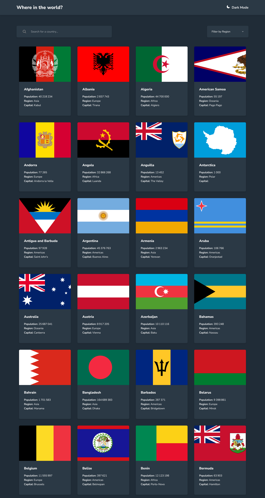
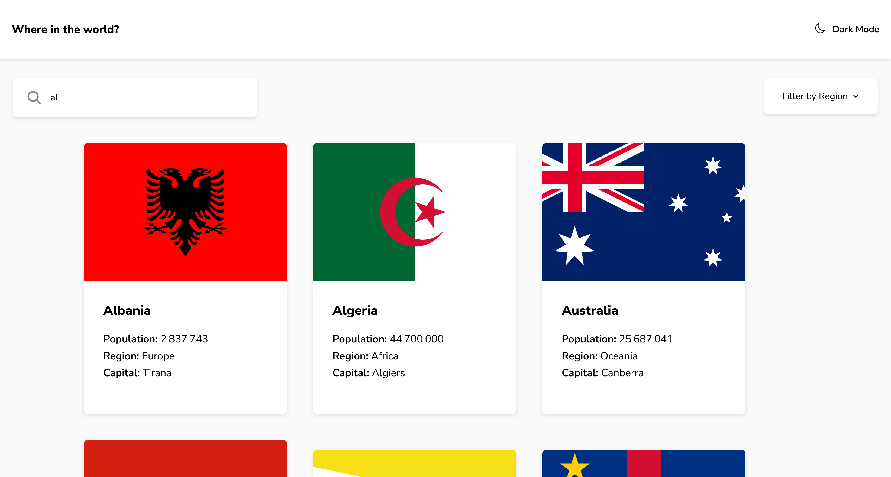
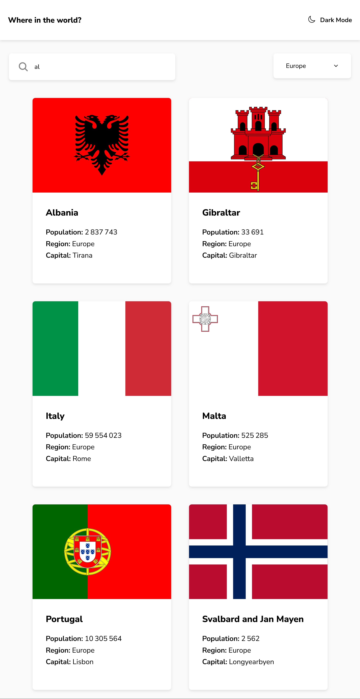
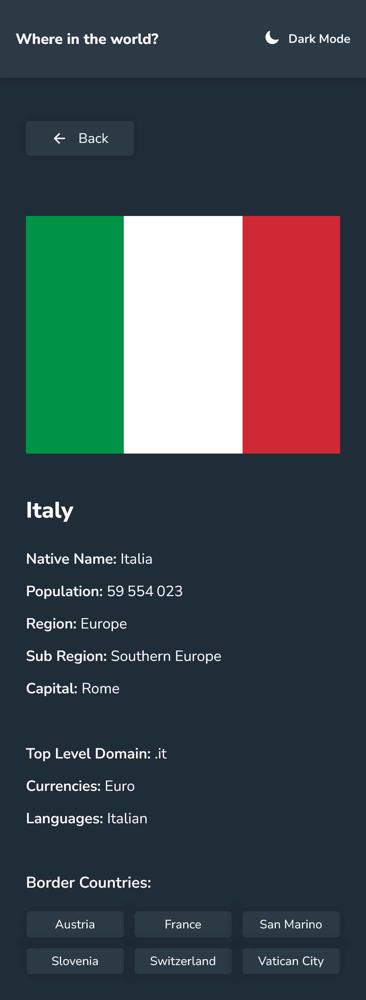

# Frontend Mentor - REST Countries API with color theme switcher solution

This is a solution to the [REST Countries API with color theme switcher challenge on Frontend Mentor](https://www.frontendmentor.io/challenges/rest-countries-api-with-color-theme-switcher-5cacc469fec04111f7b848ca). Frontend Mentor challenges help you improve your coding skills by building realistic projects.


## Overview

### The challenge

Users should be able to:

- See all countries from the API on the homepage
- Search for a country using an `input` field
- Filter countries by region
- Click on a country to see more detailed information on a separate page
- Click through to the border countries on the detail page
- Toggle the color scheme between light and dark mode

### Screenshot







### Links

- Solution URL: [https://github.com/liliaferrouk/contries](https://github.com/liliaferrouk/contries)
- Live Site URL: [https://liliaferrouk.github.io/contries/](https://liliaferrouk.github.io/contries/)

## My process

### Built with

- Semantic HTML5 markup
- CSS custom properties
- Flexbox
- CSS Grid
- Mobile-first workflow
- [React](https://reactjs.org/) - JS library


### What I learned

1. **Detecting User's Dark Mode Preference**
    - By using this function, we can enhance the user experience by automatically adapting the website’s theme to match the user's preference:

    ```javascript
    const prefersDarkMode = () => {
      return window.matchMedia && window.matchMedia('(prefers-color-scheme: dark)').matches;
    };

    const [darkMode,setDarkMode]=useState(prefersDarkMode)
    ```

2. **Lazy Loading**
    - Lazy loading allows data to be loaded as the user scrolls, rather than loading everything at once. This is particularly useful for displaying a large list of items:
    ```javascript
      const [currentPage, setCurrentPage] = useState(1);
      const [loading, setLoading] = useState(false);
      const [hasMore,setHasMore] = useState(true)
      const countriesPerPage = 8;

      const fetchCountries = async (page, reset = false) => {
          setLoading(true);
          const startIndex = (page - 1) * countriesPerPage;
          const endIndex = startIndex + countriesPerPage;
          const result = await new Promise((resolve) => {
              setTimeout(() => {
                  const dataSlice = usedData
                      .filter(country =>
                          country.name.toLowerCase().includes(searchQuery.toLowerCase()) &&
                          (filter === '' || country.region === filter)
                      )
                      .slice(startIndex, endIndex);
                  resolve(dataSlice);
              }, 500); // Simulate delay for demonstration purposes (you can remove this in your actual code)
          });
          setFilteredCountries(prevCountries => reset ? result : [...prevCountries, ...result]);
          setHasMore(result.length === countriesPerPage);
          setLoading(false);
      };

      useEffect(() => {
          if (currentPage > 1) {
              fetchCountries(currentPage);
          }
      }, [currentPage]);

      const handleScroll = () => {
          const { scrollTop, clientHeight, scrollHeight } = document.documentElement;
          if (scrollTop + clientHeight > scrollHeight -200 && !loading && hasMore) {
              setCurrentPage(prevPage => prevPage + 1);
          }
      };

      useEffect(() => {
          window.addEventListener('scroll', handleScroll);
          return () => window.removeEventListener('scroll', handleScroll);
      }, [loading, hasMore]);
    ```

3. **Creating a Fully Customized Section Component**
    - This allows for greater flexibility and control over the component's appearance and behavior. Here’s an example of a customized FilterRegions component:

    ```javascript
      function FilterRegions({ filter, setFilter, darkMode }) {
          const regions = ["Africa", "Americas", "Asia", "Europe", "Oceania", "All"];
          const [clicked, setCliqued] = useState(false);

          function handleClick(regionName) {
              if (regionName === 'All') {
                  setFilter('');
              } else {
                  setFilter(regionName);
              }
              setCliqued(false);
          }

          return (
              <div >
                  <div onClick={() => setCliqued(prev => !prev)}>
                      {
                          filter === '' ?
                          <p>Filter by Region</p> :
                          <p>{filter}</p>
                      }
                      
                  </div>
                  {
                      clicked &&
                      <div className="list">
                          {regions.map((r) => (
                              (filter !== r) && (filter !== '' || r !== 'All') && <p onClick={() => handleClick(r)} key={r}>{r}</p>
                          ))}
                      </div>
                  }
              </div>
          );
      }
    ```


## Author

- Frontend Mentor - [@liliaferrouk](https://www.frontendmentor.io/profile/liliaferrouk)